# NeuroVision
Takım 71

## Ürün ile İlgili Bilgiler

### Takım Rolleri
- Barışcan Saral: Product Owner
- Çilem Çağla Çakırer: Scrum Master
- Pelşin Gündüz: ML/Data Developer
- Taha Öztürk: App&Integration Developer

### Ürün İsmi
NeuroScan AI

### Ürün Açıklaması
NeuroScan AI, beyin MR görüntülerini derin öğrenme modeli ile analiz ederek tümör varlığı ve olası tümör tipini tahmin etmeyi amaçlayan eğitim/karar destek prototipidir. Kullanıcı bir MR görüntüsü yükler; sistem görüntüyü işler, model tahminini ve güven skorunu gösterir. Proje klinik tanı koymak için değil, boo tcamp ve eğitim amaçlı geliştirilmiştir.

### Ürün Özellikleri
- MR görüntüsü yükleme
- Görüntü ön işleme
- Glioma, meningioma, pituitary ve no_tumor sınıflandırması
- Güven skoru gösterimi
- Model performans metrikleri
- Grad-CAM ile açıklanabilir yapay zeka görselleştirmesi
- Kullanıcı dostu web arayüzü

### Hedef Kitle
- Tıp fakültesi öğrencileri
- Sağlık teknolojisi öğrencileri
- Yapay zeka ve medikal görüntüleme alanıyla ilgilenenler
- Radyoloji karar destek sistemlerini araştıran ekipler
- Eğitim ve demo amaçlı kullanıcılar

### Medikal Uyarı
Bu uygulama klinik tanı koymak amacıyla geliştirilmemiştir. Eğitim, araştırma ve demo amaçlı bir yapay zekâ karar destek prototipidir. Nihai karar için mutlaka uzman hekim değerlendirmesi gereklidir.

### Product Backlog URL
[NeuroVision Sprint Board](https://github.com/users/bariscansaral/projects/1)

---

# Sprint 1
- **Backlog Düzeni ve Story Seçimleri:** Product Backlog, proje önceliklerine göre oluşturulmuş ve Sprint 1 için yüksek öncelikli User Story'ler seçilmiştir. Her User Story görevlerine ayrılarak GitHub Project Board üzerinden yönetilmiştir.

  Story'ler yapılacak işlere (Task'lere) bölünmüştür. Her User Story, geliştirme sürecini daha düzenli yönetebilmek amacıyla küçük görevlere ayrılmış ve takım üyelerine atanmıştır

- **Daily Scrum:** İletişim kolaylığı açısından Daily Scrum toplantılarının WhatsApp üzerinden yazılı olarak gerçekleştirilmesine karar verilmiştir. Günlük toplantılarda tamamlanan çalışmalar, devam eden görevler ve karşılaşılan engeller paylaşılmıştır. Sprint 1'e ait günlük Scrum kayıtları **[Sprint 1 Documents](ProjectManagement/Sprint1Documents/daily_scrum.md)** dosyasında yer almaktadır.

- **Sprint board update:** Sprint board screenshotları:
  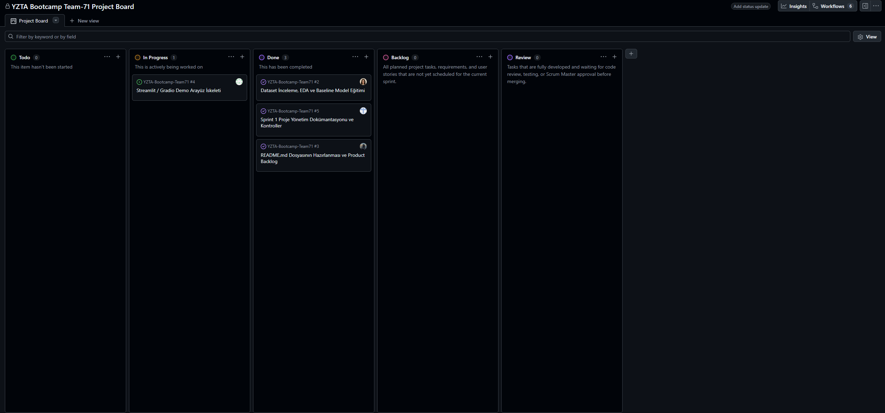

  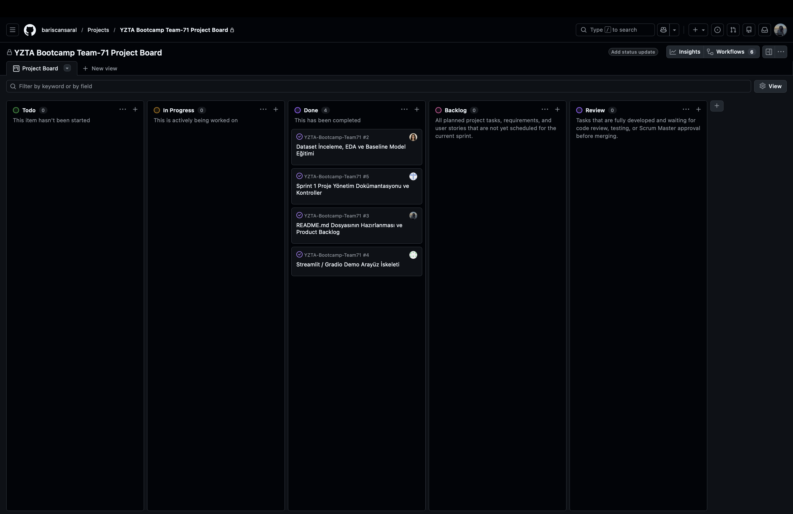

- **Ürün Durumu:** Ekran görüntüleri:
  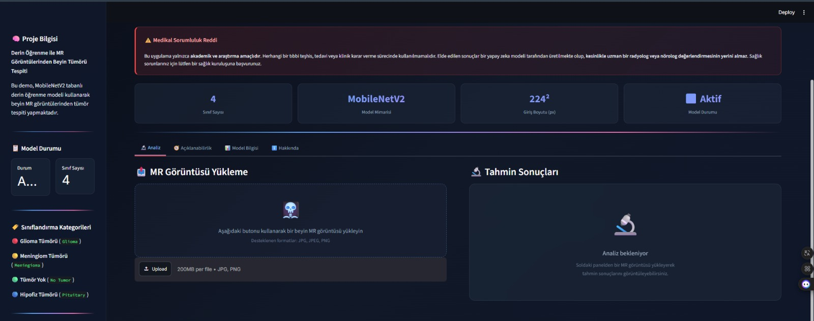

  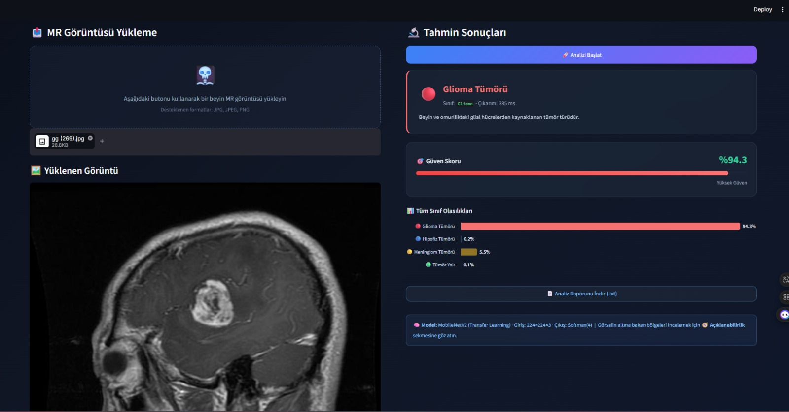

  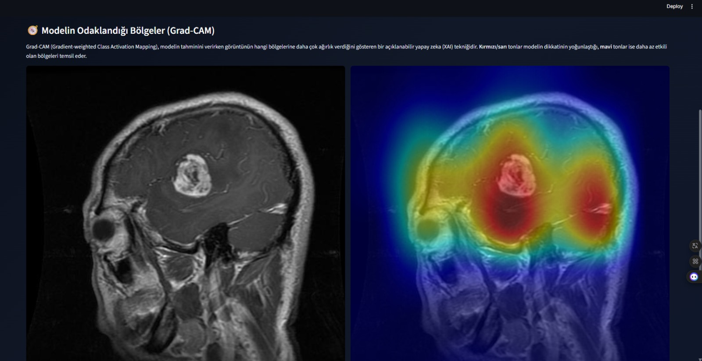

  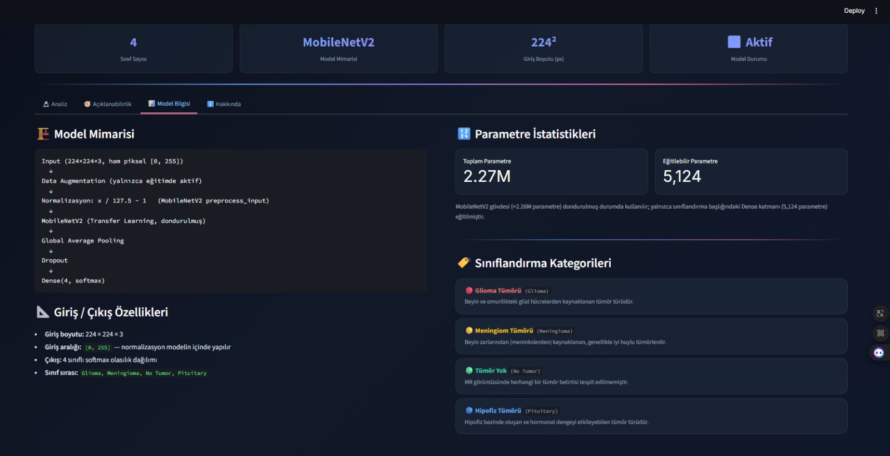

- **Sprint Review:** Sprint 1 hedefleri başarıyla tamamlanmıştır. Veri setinin analizi (EDA), MobileNetV2 tabanlı baseline modelin geliştirilmesi ve temel performans değerlendirmeleri tamamlanmıştır. GitHub Project Board ve README dokümantasyonu oluşturulmuş, uygulamanın ilk kullanıcı arayüzü hazırlanmıştır.

  Sprint sonunda model performansını artırmak amacıyla bir sonraki sprintte fine-tuning çalışmalarının yapılmasına, Grad-CAM tabanlı açıklanabilir yapay zekâ desteğinin eklenmesine ve eğitilen modelin Streamlit arayüzüne entegre edilmesine karar verilmiştir. Ayrıca kullanıcı deneyimini geliştirecek arayüz iyileştirmeleri ve ek özelliklerin Sprint 2 kapsamında tamamlanması planlanmıştır.

  **Sprint Review Katılımcıları:**
  - Barışcan Saral
  - Çilem Çağla Çakırer
  - Pelşin Gündüz
  - Taha Öztürk

- **Sprint Retrospective:**
  - Takım içi iletişim ve görev dağılımının etkili olduğu görülmüş, mevcut çalışma düzeninin sürdürülmesine karar verilmiştir.
  - Sprint başlangıcında yaşanan zamanlama ve senkronizasyon sorunlarını azaltmak amacıyla ara kontrol toplantılarının daha erken başlatılmasına karar verilmiştir.
  - Sprint 2'de model performansını artırmak için fine-tuning çalışmalarına öncelik verilmesi kararlaştırılmıştır.
  - Grad-CAM entegrasyonu için gerekli teknik araştırmaların sprintin başında tamamlanması ve gerçek modelin Streamlit arayüzüne entegre edilmesi hedeflenmiştir.
  - İş ve staj programları göz önünde bulundurularak, düzenli haftalık kısa senkronizasyon toplantıları yapılmasına karar verilmiştir.

---

# Sprint 2

- **Backlog Düzeni ve Story Seçimleri:** Sprint 2'de mevcut beyin tümörü modelinin performansını fine-tuning ile artırmak, projeyi çok modelli hale getirerek anemi ve otoimmün hastalık tahmin modellerini sisteme entegre etmek, açıklanabilir yapay zekâ (Grad-CAM) desteğini eklemek ve tüm modeller için standart veri ve etiket yapısını oluşturmak hedeflenmiştir. Sprint görevleri GitHub Project Board üzerinden takip edilmiş ve ekip üyeleri arasında paylaştırılmıştır.

- **Daily Scrum:** Daily Scrum toplantıları WhatsApp üzerinden yazılı olarak gerçekleştirilmiş, ekip üyeleri tamamlanan görevleri, devam eden çalışmaları ve karşılaşılan teknik sorunları düzenli olarak paylaşmıştır. Sprint 2'ye ait günlük Scrum kayıtları **[Sprint 2 Documents](ProjectManagement/Sprint2Documents/daily_scrum.md)** dosyasında yer almaktadır.

- **Sprint board update:** Sprint board screenshotları:

  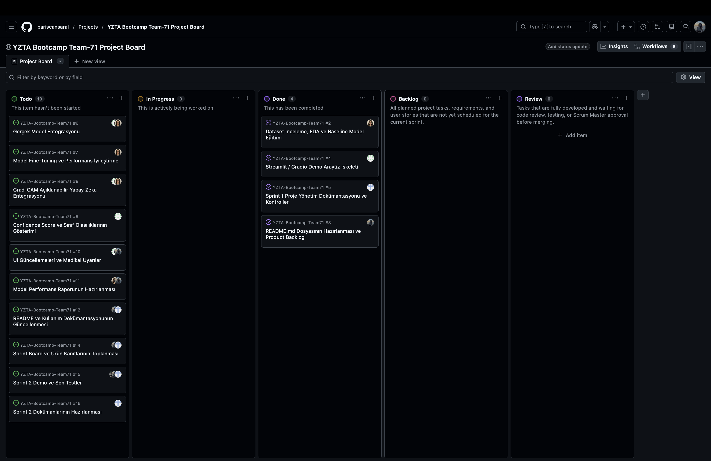

  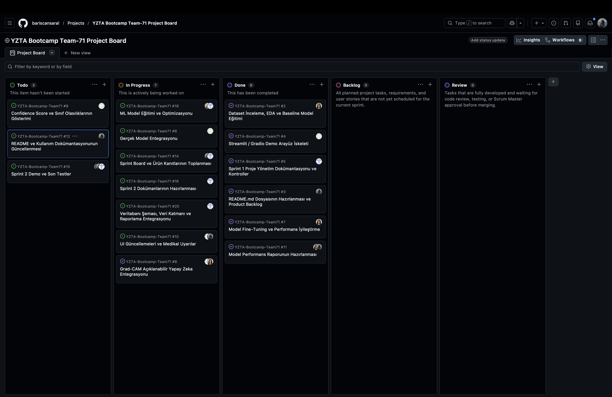

  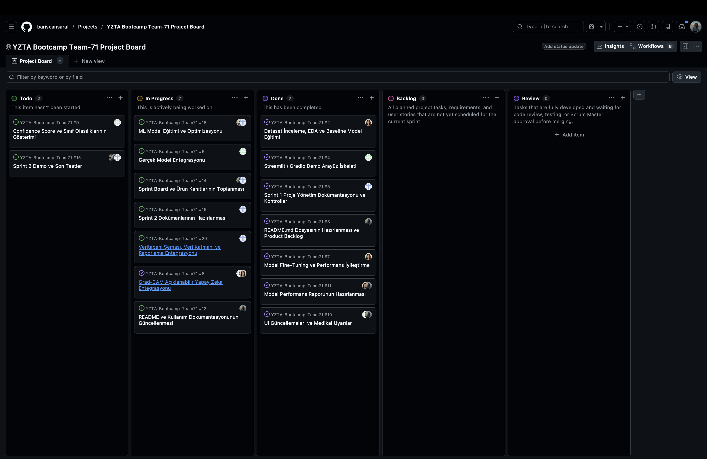

  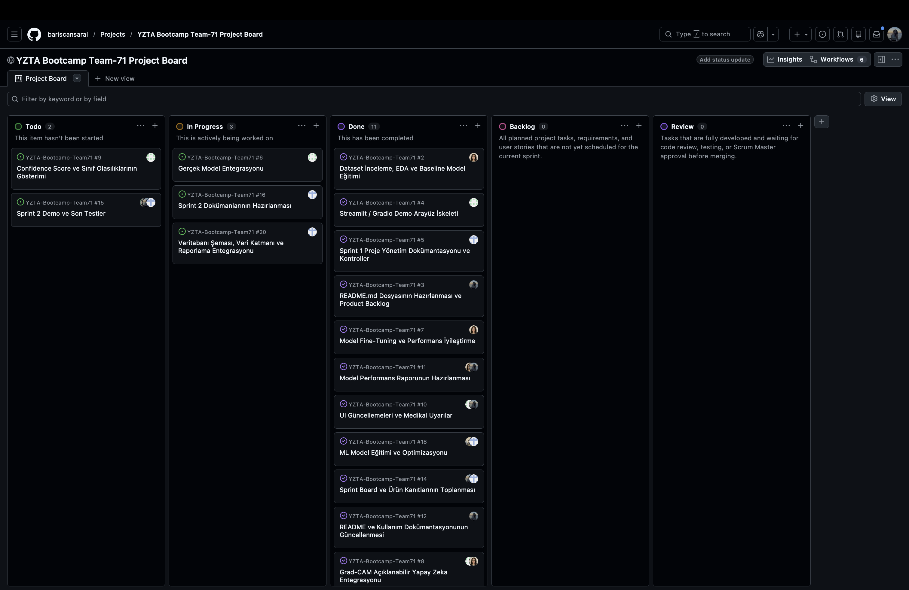

- **Ürün Durumu:** Ekran görüntüleri:

  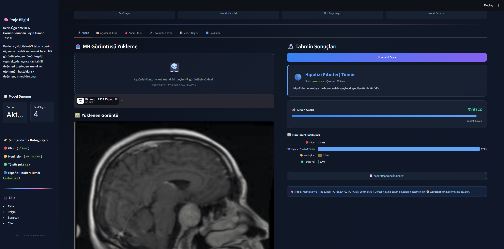

  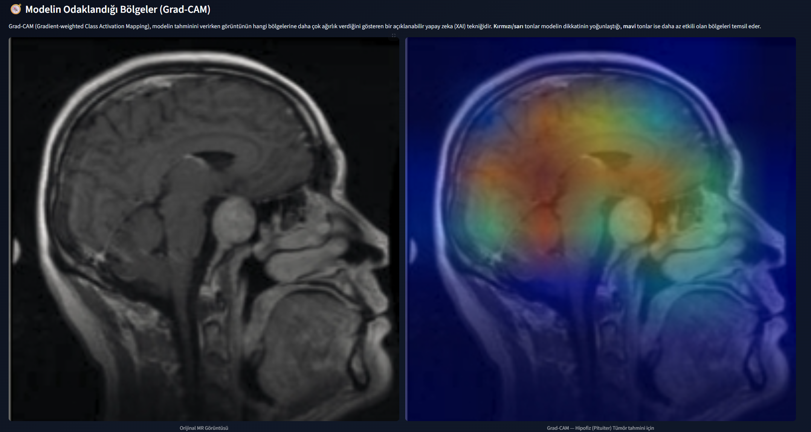

  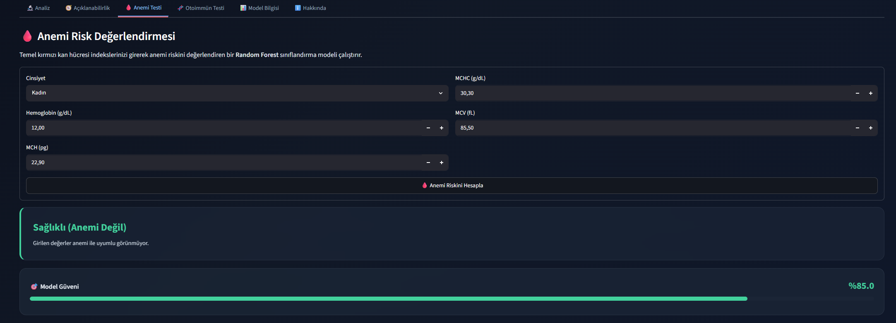

  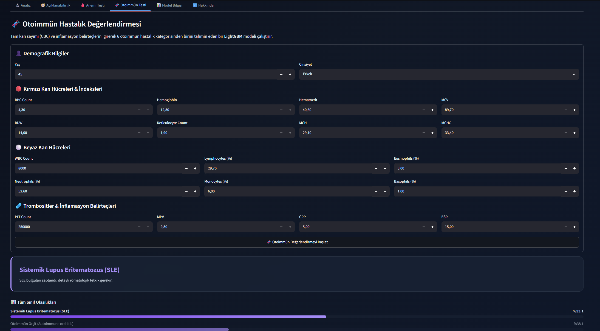

  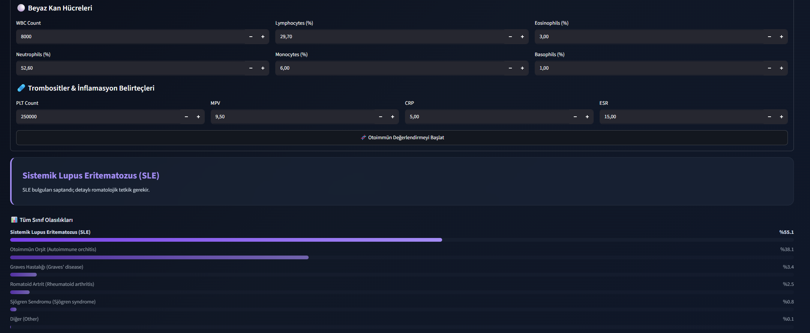

  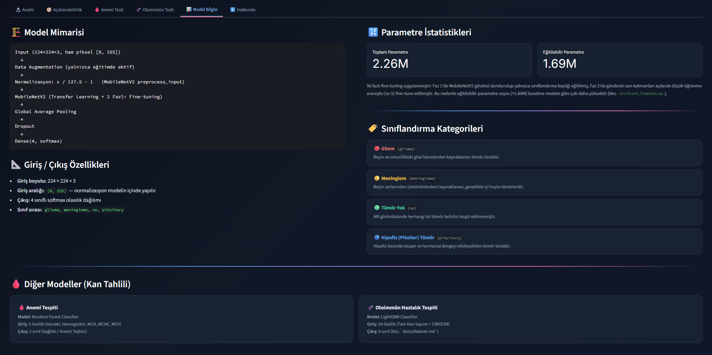

- **Sprint Review:** Sprint 2 hedefleri büyük ölçüde başarıyla tamamlanmıştır. MobileNetV2 modeli üzerinde iki aşamalı fine-tuning uygulanarak model doğruluğu %84.69 seviyesine yükseltilmiştir. Anemi ve otoimmün hastalık tahmin modelleri projeye entegre edilmiş, Grad-CAM ile açıklanabilir yapay zekâ desteği eklenmiştir. Tüm modeller için ortak **labels.json** yapısı oluşturulmuş ve **dataset.md** ile teknik dokümantasyon tamamlanmıştır. Branch süreçleri birleştirilmiş, teknik çakışmalar giderilmiş ve proje **main** branch üzerinde kararlı hale getirilmiştir.

  Sprint sonunda bazı çalışmalar Sprint 3'e aktarılmıştır:
  - Modüller arası haberleşmenin (Chatbot – Model – Veritabanı) daha da optimize edilmesi.
  - Gerçek medikal veriler ile uçtan uca (end-to-end) sistem testlerinin tamamlanması.
  - Kullanıcı kılavuzları ve teknik mimari dokümantasyonunun son hâline getirilmesi.

  **Sprint Review Katılımcıları:**
  - Barışcan Saral
  - Çilem Çağla Çakırer
  - Pelşin Gündüz
  - Taha Öztürk

- **Sprint Retrospective:**
  - MobileNetV2 modeli üzerinde gerçekleştirilen iki aşamalı fine-tuning stratejisi ile model doğruluğu %79.11 seviyesinden %84.69 seviyesine yükseltildi.
  - Proje kapsamı genişletilerek yalnızca beyin tümörü sınıflandırması yapan yapıdan, anemi ve otoimmün hastalık tahminlerini de destekleyen çok modüllü bir sisteme geçildi.
  - Grad-CAM, **labels.json** ve **model_report_v2.md** gibi teknik bileşenler sayesinde sistemin açıklanabilirliği ve teknik dokümantasyonu güçlendirildi.
  - Model eğitimi ve arayüz geliştirmelerinin paralel ilerlemesi zaman zaman darboğazlara neden olduğundan, Sprint 3'te görev bağımlılıklarının daha yakından takip edilmesine karar verildi.
  - Proje hızlı büyüdüğü için dokümantasyonun kod geliştirme süreciyle eş zamanlı ilerletilmesi gerektiği konusunda ekip fikir birliğine vardı.
  - Sprint 3'te kullanıcı arayüzü entegrasyonunun tamamlanması, uçtan uca sistem testlerinin gerçekleştirilmesi, yeni model eğitimlerinin tamamlanması ve model optimizasyonlarının bitirilmesi hedeflenmiştir.

---

# Sprint 3